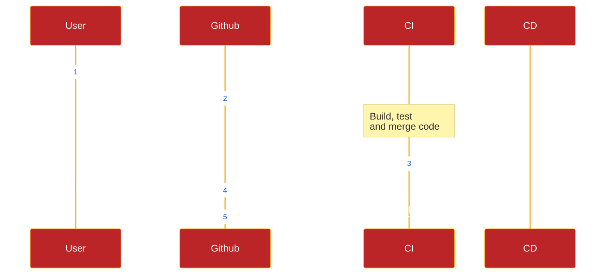
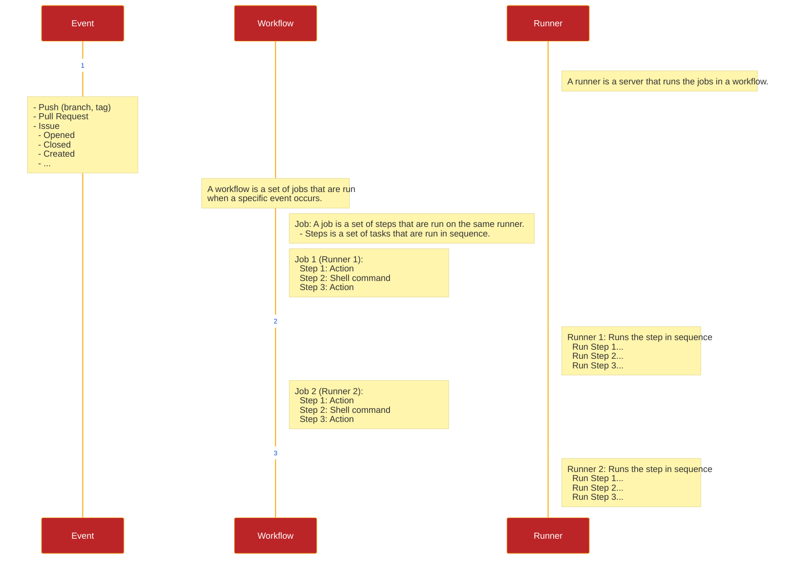

# Github Actions

## Components of a GitHub Actions Workflow

It composes of the following components (also terminologies):

- **Workflow**
- **Events**
- **Job**
- **Step**
- **Runner**

## Setup Environment Variables

You can view this [link](https://vercel.com/guides/how-can-i-use-github-actions-with-vercel) to learn how to setup environment variables in Github Actions.

And have a look at these screenshots:

## Documentation

You can check the [documentation](https://docs.github.com/en/actions/reference/events-that-trigger-workflows) for more **events**.